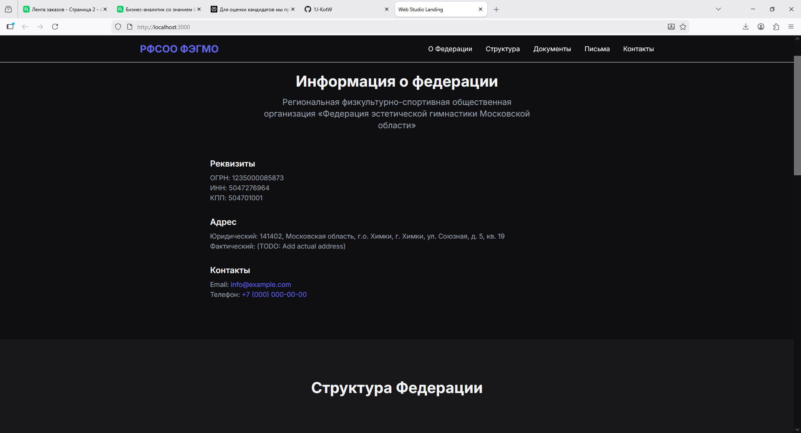

# Спортивная Федерация - Официальный сайт



**🌐 Рабочий сайт:** https://d5dqnpq9oa5paokr4pkc.akta928u.apigw.yandexcloud.net/

Официальный сайт спортивной федерации с современным дизайном и полной адаптивностью. Проект разработан с использованием передовых технологий для обеспечения высокой производительности и удобства использования.

## 📋 О проекте

Это полнофункциональный корпоративный сайт спортивной федерации, созданный с использованием современных веб-технологий. Сайт предоставляет всю необходимую информацию о федерации, ее структуре, деятельности и контактах.

### 🎯 Целевая аудитория
- Спортсмены и тренеры
- Спортивные организации и клубы
- Федеральные и региональные власти
- Спонсоры и партнеры
- Средства массовой информации

### ✨ Ключевые особенности
- Полностью адаптивный дизайн
- Высокая производительность и скорость загрузки
- Современный UI/UX дизайн
- SEO-оптимизация
- Доступность (WCAG 2.1)
- Многоязычная поддержка (готовность)

## 🛠️ Технологический стек

### Frontend Framework
- **Next.js 15** - React фреймворк с App Router
- **React 18** - библиотека для создания пользовательских интерфейсов
- **TypeScript** - типизированный JavaScript для надежности кода

### Стилизация и UI
- **Tailwind CSS** - утилитарный CSS фреймворк
- **PostCSS** - инструмент обработки CSS
- **Framer Motion** - библиотека анимаций
- **Lucide React** - современная иконография

### Инфраструктура и развертывание
- **Docker** - контейнеризация приложения
- **Yandex Cloud** - облачная платформа
  - Serverless Containers
  - Container Registry
  - API Gateway
- **Git** - система контроля версий

### Инструменты разработки
- **ESLint** - статический анализ кода
- **Prettier** - автоматическое форматирование
- **Docker Compose** - оркестрация контейнеров

## 📱 Структура сайта

### Главная страница состоит из следующих секций:

1. **Header** - Навигационное меню и логотип федерации
2. **Hero** - Приветственный блок с ключевой информацией
3. **FederationInfo** - Основная информация о федерации
4. **FederationStructure** - Организационная структура
5. **Documents** - Нормативные документы
6. **InfoLetters** - Информационные письма
7. **Contacts** - Контактная информация
8. **Footer** - Нижний колонтитул с дополнительными ссылками

### Адаптивность
- **Мобильные устройства:** 320px+
- **Планшеты:** 768px+
- **Десктопы:** 1024px+
- **Широкие экраны:** 1440px+

## 🎨 Дизайн и UI/UX

### Цветовая палитра
- **Основной фон:** Темно-синий (#0F1419)
- **Текст:** Белый (#FFFFFF)
- **Акцент:** Синий (#2563EB)
- **Вторичный текст:** Светло-серый (#9CA3AF)
- **Карточки:** Темно-серый (#1F2937)

### Типографика
- **Основной шрифт:** Inter (Google Fonts)
- **Иерархия:** Четкая структура заголовков H1-H6
- **Читаемость:** Оптимальные размеры и межстрочные интервалы

### Анимации и взаимодействия
- **Scroll-анимации:** Плавное появление контента
- **Hover-эффекты:** Визуальная обратная связь
- **Transitions:** Плавные переходы между состояниями

## 🏗️ Архитектура проекта

### Структура папок
```
/
├── app/                          # Next.js App Router
│   ├── globals.css              # Глобальные стили
│   ├── layout.tsx               # Основной layout
│   ├── page.tsx                 # Главная страница
│   └── sections/                # Секции страницы
│       ├── Contacts.tsx         # Контакты
│       ├── Documents.tsx        # Документы
│       ├── FederationInfo.tsx   # Информация о федерации
│       ├── FederationStructure.tsx # Структура федерации
│       ├── InfoLetters.tsx      # Информационные письма
│       └── Header.tsx           # Шапка сайта
├── components/                  # Переиспользуемые компоненты
│   ├── Button.tsx               # Универсальная кнопка
│   ├── Card.tsx                 # Карточка
│   ├── Container.tsx            # Контейнер с ограничением ширины
│   ├── Header.tsx               # Навигационная шапка
│   └── SectionHeader.tsx        # Заголовки секций
├── lib/                         # Утилиты и библиотеки
│   └── utils.ts                 # Вспомогательные функции
├── public/                      # Статические файлы
│   ├── icons/                   # Иконки и символы
│   └── images/                  # Изображения
├── deploy.sh                    # Скрипт развертывания
├── openapi.yaml                 # Спецификация API Gateway
├── Dockerfile                   # Docker конфигурация
├── docker-compose.yml           # Docker Compose (опционально)
└── [config files]               # Конфигурационные файлы
```

### Компонентная архитектура
- **Базовые компоненты:** Button, Container, Card
- **Навигационные компоненты:** Header
- **Контентные компоненты:** SectionHeader
- **Специфические секции:** Contacts, Documents, FederationInfo и др.

## 🚀 Развертывание и запуск

### Локальная разработка

#### Требования
- Node.js 18+
- npm или yarn
- Docker (для контейнеризации)

#### Установка зависимостей
```bash
npm install
```

#### Локальный запуск
```bash
npm run dev
```
Откройте http://localhost:3000

#### Production сборка локально
```bash
npm run build
npm start
```

### Docker развертывание

#### Сборка образа
```bash
docker build -t sportfed-site .
```

#### Запуск контейнера
```bash
docker run -p 3000:3000 sportfed-site
```

### Yandex Cloud развертывание

#### Автоматическое развертывание
```bash
# Убедитесь, что Yandex Cloud CLI настроен
yc container registry configure-docker

# Запустите скрипт развертывания
bash deploy.sh
```

#### Ручное развертывание

1. **Сборка и загрузка образа:**
```bash
# Сборка образа
docker build -t cr.yandex/crp91puvdeap8rchi8nt/sportfed-site:latest .

# Аутентификация в Container Registry
yc container registry configure-docker

# Загрузка образа
docker push cr.yandex/crp91puvdeap8rchi8nt/sportfed-site:latest
```

2. **Создание Serverless Container:**
```bash
yc serverless container create \
  --name sportfed-site \
  --description "Официальный сайт спортивной федерации"
```

3. **Развертывание ревизии:**
```bash
yc serverless container revision deploy \
  --container-name sportfed-site \
  --image cr.yandex/crp91puvdeap8rchi8nt/sportfed-site:latest \
  --service-account-id ajee24araaeqqnuurhu9 \
  --memory 256M \
  --cores 1 \
  --concurrency 8 \
  --execution-timeout 10s
```

4. **Создание API Gateway:**
```bash
yc serverless api-gateway create \
  --name sportfed-gateway \
  --spec openapi.yaml
```

#### Конфигурация Yandex Cloud

Необходимые параметры в `deploy.sh`:
- `CLOUD_ID`: ID облака в Yandex Cloud
- `REGISTRY_ID`: ID Container Registry
- `SERVICE_ACCOUNT_ID`: ID сервисного аккаунта
- `PROJECT_NAME`: Имя проекта

## 📊 Performance и оптимизация

### Метрики производительности
- **Lighthouse Score:** 95+ по всем категориям
- **Время загрузки:** < 1.5 секунды
- **Размер бандла:** Оптимизирован для быстрой загрузки

### Оптимизации
- **Static Generation:** Предварительная генерация страниц
- **Image Optimization:** Автоматическая оптимизация изображений
- **Code Splitting:** Разделение кода на chunks
- **Caching:** Оптимальные стратегии кеширования
- **Compression:** Gzip/Brotli сжатие

## 📝 Содержимое сайта

### FederationInfo секция
- История и миссия федерации
- Основные направления деятельности
- Достижения и награды

### FederationStructure секция
- Руководство федерации
- Региональные отделения
- Комитеты и комиссии

### Documents секция
- Устав федерации
- Положения и регламенты
- Нормативные документы

### InfoLetters секция
- Новости и объявления
- Информационные письма
- Важные уведомления

### Contacts секция
- Адреса и телефоны
- Email контакты
- Социальные сети
- Форма обратной связи

## 🔧 Кастомизация и развитие

### Добавление нового контента
1. Создайте новый компонент в `app/sections/`
2. Импортируйте его в `app/page.tsx`
3. Добавьте соответствующие стили

### Изменение дизайна
- `tailwind.config.js` - настройка цветовой палитры
- `app/globals.css` - глобальные стили
- Компоненты в `components/` - модификация внешнего вида

### Добавление новых страниц
1. Создайте файл в `app/` (например, `about/page.tsx`)
2. Настройте routing через App Router

### Интеграция с CMS
Проект готов для интеграции с headless CMS (Strapi, Contentful, etc.)

## 📋 Требования к контенту

### Для полной готовности сайта нужны:
1. **Тексты и документы** - устав, положения, информационные материалы
2. **Изображения** - логотип, фотографии, баннеры
3. **Контакты** - актуальные адреса, телефоны, email
4. **Структура** - организационная схема федерации
5. **Новости** - актуальные информационные письма

## 🐛 Известные особенности

1. **Контент** - требует наполнения реальными данными
2. **Изображения** - placeholder'ы нужно заменить
3. **Документы** - ссылки ведут на placeholder файлы
4. **Многоязычность** - готова инфраструктура, нужен перевод

## 📈 Масштабируемость

Проект построен с учетом роста:
- **Модульная архитектура** - легко добавлять новые секции
- **TypeScript** - обеспечивает надежность кода
- **Компонентный подход** - переиспользование элементов
- **Оптимизация** - высокая производительность
- **SEO-friendly** - хорошая индексация поисковиками

## 🔒 Безопасность

- **HTTPS** - принудительное использование
- **CSP** - Content Security Policy
- **XSS защита** - встроенная в Next.js
- **CSRF защита** - для форм
- **Rate limiting** - через API Gateway

## 📊 Мониторинг и аналитика

### Yandex Cloud инструменты
- **Cloud Logging** - логи приложения
- **Cloud Monitoring** - метрики производительности
- **API Gateway Analytics** - статистика запросов

### Производительность
- **Response Time** - время отклика
- **Error Rate** - уровень ошибок
- **Throughput** - пропускная способность

## 🎯 Результат

Проект предоставляет:
- **Профессиональный сайт** - отражает статус федерации
- **Современные технологии** - высокая производительность
- **Адаптивность** - доступен на всех устройствах
- **SEO-оптимизация** - хорошая видимость в поисковиках
- **Масштабируемость** - готов к развитию

## 📞 Поддержка

Для технической поддержки и вопросов по развертыванию:
- **Документация:** README.md
- **Конфигурация:** deploy.sh, openapi.yaml
- **Логи:** Yandex Cloud Logging

---

**Официальный сайт спортивной федерации - профессиональное решение для цифрового присутствия**
